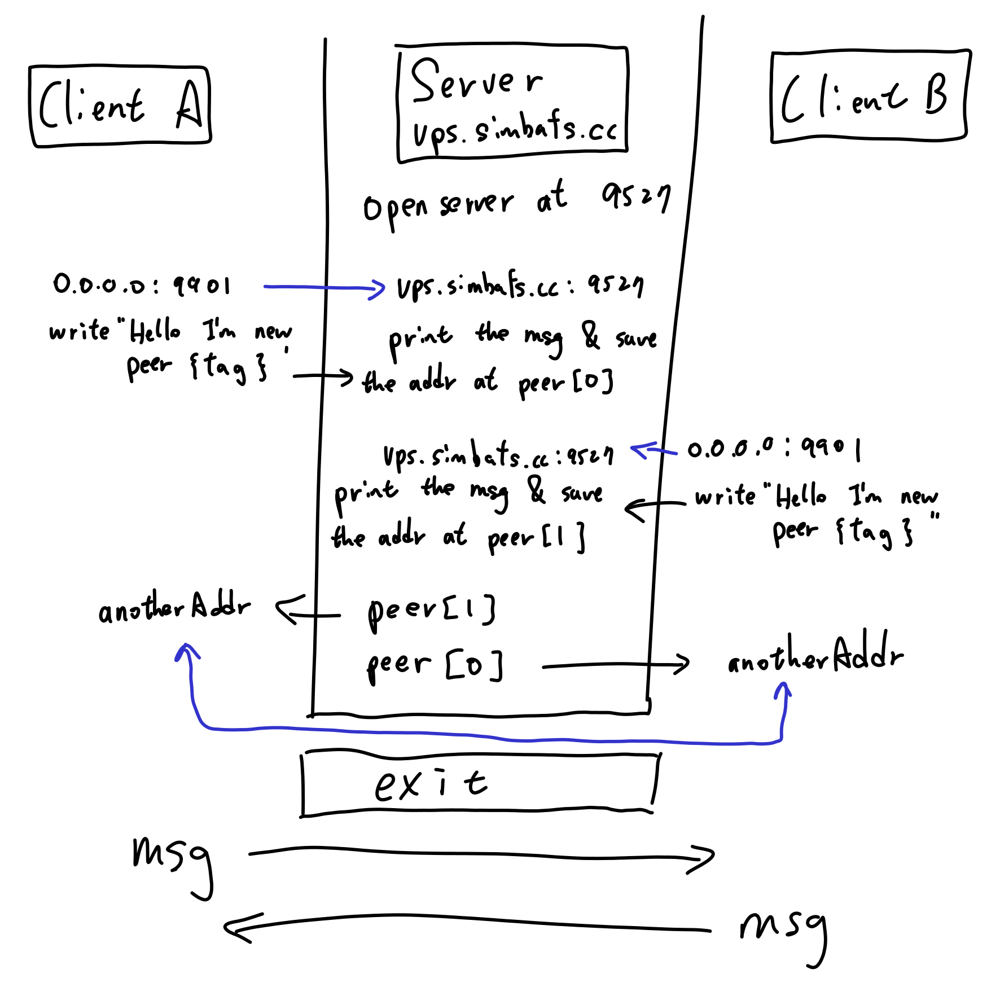

# experiment-p2p
# [blog](https://blog.simbafs.cc/posts/golang/p2p/)

# Build/Install
`make`

# Run
## server
`./gop2p server`

## client A 
`./gop2p client -t A -a <ip of server>`

## client A 
`./gop2p client -t B -a <ip of server>`

After the p2p connection is built, the server will exit. The two client will send a random int [0,100) to each other

> **Note**  
> the default <ip of serrver> is my vps' ip

ref: https://blog.nowcoder.net/n/4cd4fd71452c40c18cdfeb92383117e5
